# How to Run the BiRSwinT Code

This tutorial assumes you're running Python version 3.9.

## Preparing the Model Data

Before we get started, we need to download several pretrained model files. Unfortunately, the author didn't provide the
specific model file they used, so we'll have to rely on other sources.

Please note that I can't provide the exact source of the model file, so I will provide a link to the model file that I
think is appropriate. These model files should be sufficient to run and test the framework.

In [BiRSwinT.py](BiRSwinT.py), there are two checkpoints where we need to use some pretrained model files.

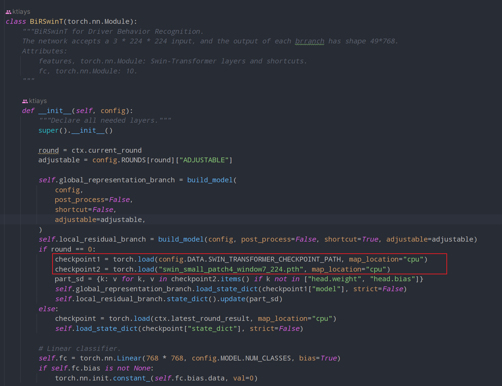

1. **SWIN_TRANSFORMER_CHECKPOINT_PATH** - `ckpt_epoch_44.pth`

   By default, the SWIN_TRANSFORMER_CHECKPOINT_PATH is set to `ckpt_epoch_44.pth` (located
   in [BiRSwinT.yaml](configs/BiRSwinT/BiRSwinT.yaml)).

   However, I was unable to locate this file online, so I used the
   following file instead:

   https://huggingface.co/ZJF-Thunder/Swin-Transformer-Object-Detection/blob/main/checkpoints/epoch_50.pth

   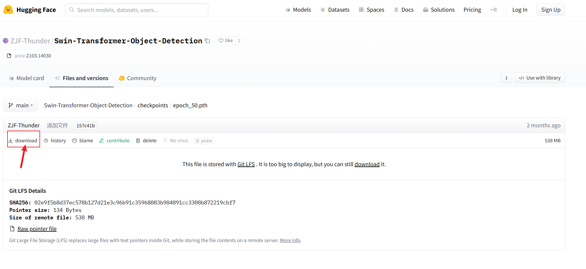

   You can download this file, rename it to `ckpt_epoch_44.pth`, and place it in the root directory of this project.

   Alternatively, you can change the configuration file to set the SWIN_TRANSFORMER_CHECKPOINT_PATH to the location of
   the file you've downloaded.

2. `swin_small_patch4_window7_224.pth`

   You can download this file from here: https://huggingface.co/microsoft/swin-small-patch4-window7-224/tree/main

   Locate the file named `pytorch_model.bin`, download it, rename it to `swin_small_patch4_window7_224.pth`, and place
   it in the root directory of the project.

   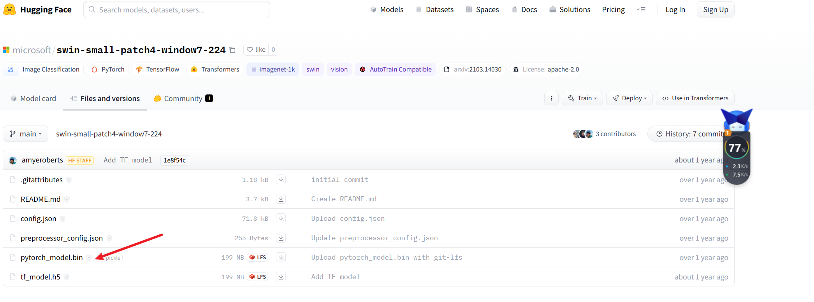

## Preparing the Training and Validation Dataset

1. Create a directory named `AUCCamera` in the root directory.

2. Download the dataset from Kaggle: https://www.kaggle.com/competitions/state-farm-distracted-driver-detection/data

3. Extract the data into the `AUCCamera` directory. The two CSV files are not needed and can be safely deleted.

4. Move the 'train' and 'test' folders out of the 'imgs' folder. Remove the 'imgs' folder if you like.

   Your `AUCCamera` directory should now look like this:

   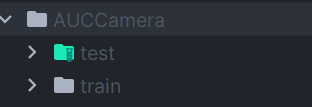

5. Since we don't have category labels for the test images, we can partition our training images into a training and a
   validation set. I have written a Jupyter notebook ([split_train_val.ipynb](split_train_val.ipynb)) for this purpose,
   which you can find in
   the root directory.

6. After completing the steps above, your project folder should look like this:

   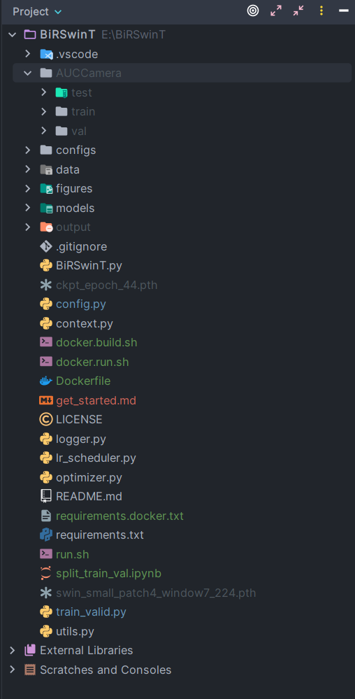

   Verify the total number of images in the training and validation sets to ensure that you've partitioned the data
   correctly.

## Running the Code

### Running in a Conda/Virtual Environment

If you prefer to run the code in your conda or virtual environment, rather than a Docker container or virtual machine,
you can simply install the requirements using pip and then execute [run.sh](run.sh).

   ```shell
   pip install -r requirements.txt
   ```

### Recommended Method: Running in Docker

If you don't have PyTorch, CUDA, or other dependencies, or if you'd like to simplify the process, it's recommended to
run the code in Docker.

1. Run [docker.build.sh](docker.build.sh).

2. Edit [docker.run.sh](docker.run.sh) to mount your project folder. In my case, I've stored the project in my E drive
   and I run
   scripts in Windows WSL2 Ubuntu, so I've mounted the project folder in the E drive(`/mnt/e/BirSwinT`) to the Docker
   container.

   ```shell
   docker run -it --gpus=all -v /mnt/e/BirSwinT:/BirSwinT birswint:base /bin/bash
    ```

   Replace `/mnt/e/BirSwinT` with the path of your own project folder.

3. Run [docker.run.sh](docker.run.sh).

   `docker.run.sh` will navigate you to the Docker container, where you can execute [run.sh](run.sh) or the following
   script (which
   is the same as `run.sh`) to train and validate the framework:

   ```shell
   python train_valid.py --cfg=configs/BiRSwinT/BiRSwinT.yaml
   ```

## Starting the Training and Validating Process

If you've started `run.sh` correctly, you should see a prompt like this:

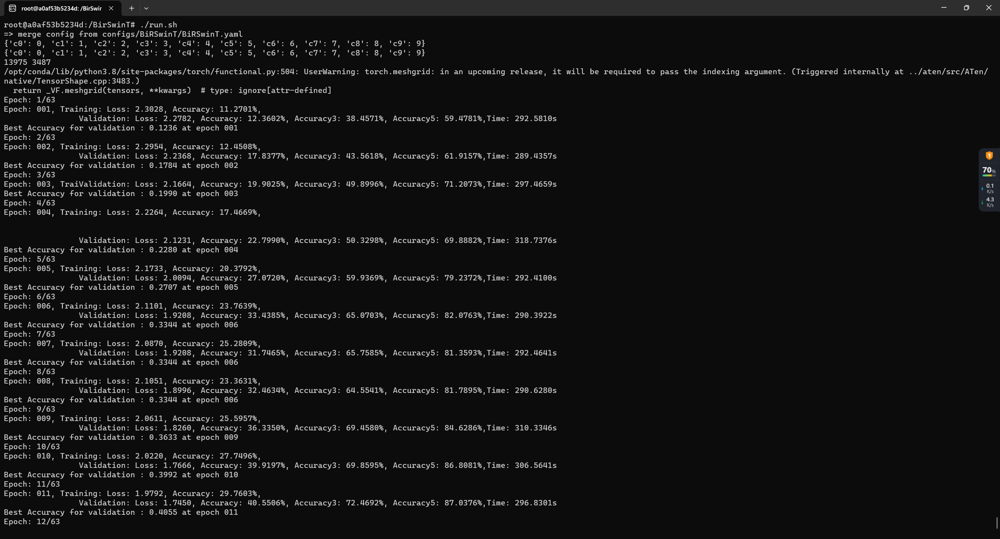

## Other modifications I made

1. KeyError: 'Non-existent config key: MODEL.SWIN'

   If you encounter an error like `KeyError: 'Non-existent config key: MODEL.SWIN'`, you'll need to add the parameter
   into [config.py](config.py) and [BiRSwinT.yaml](configs/BiRSwinT/BiRSwinT.yaml).

   For example, I ran into the following error:

   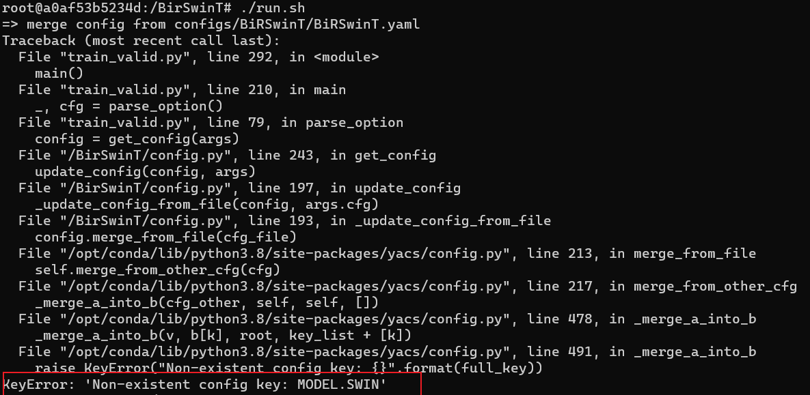

   To solve error like this, I added the following code to `config.py`:

   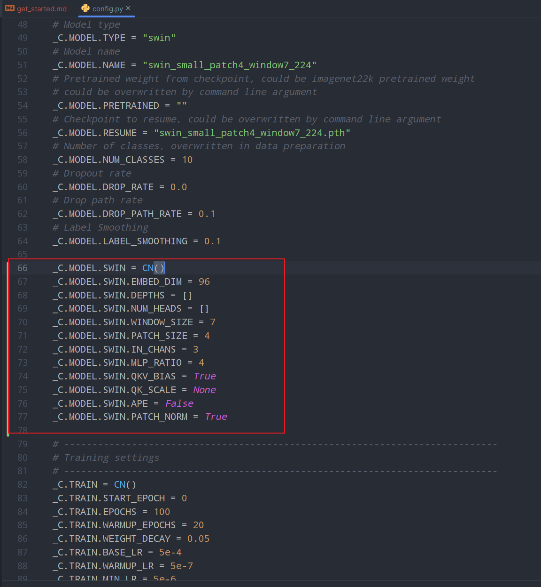

   and [BiRSwinT.yaml](configs/BiRSwinT/BiRSwinT.yaml)

   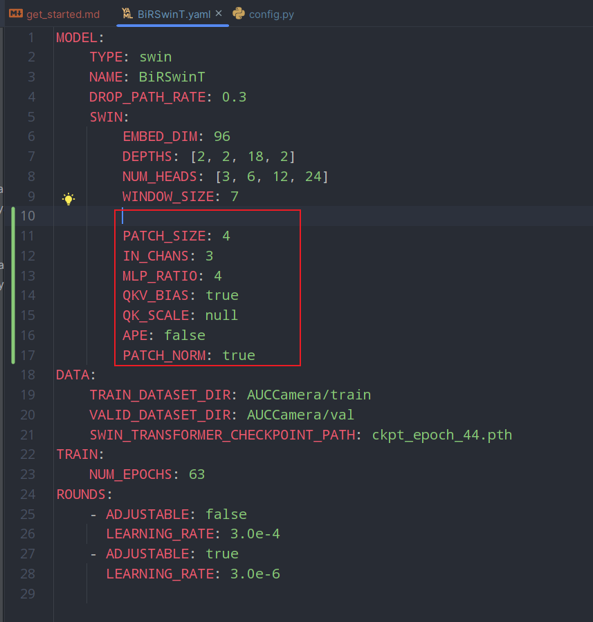

   You can simply copy and paste the lines from [config.py](config.py)
   and [BiRSwinT.yaml](configs/BiRSwinT/BiRSwinT.yaml) in this repository into your own code.

2. KeyError: 'model'

   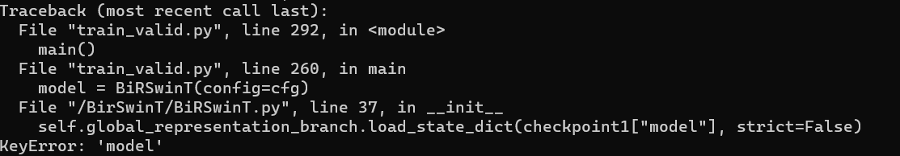

   This error is because the model file we download is not the same as the model file used by the author.

   To solve this, simply remove the `['model']` in [BiRSwinT.py](BiRSwinT.py) line 37.

   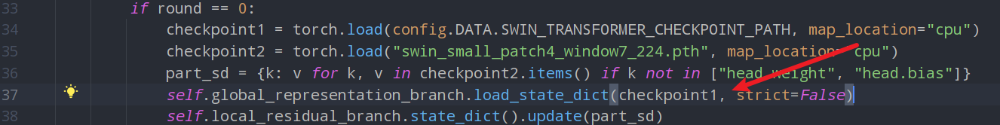

## Contact Me

**If you have any questions, feel free to create an issue in this repository or reach me at gmail: `daydreamqian+BiRSwinT`.**